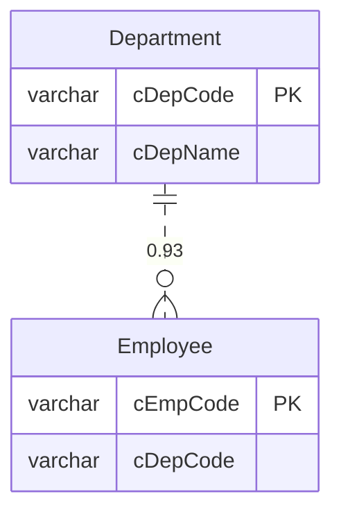

# Schema Analyzer 🔍

> 通用数据库结构分析器 - 自动推断表关系 + AI 增强字段解释

[](https://opensource.org/licenses/MIT)
[](https://golang.org/)
[](https://dashscope.aliyuncs.com/)

一个专为**遗留系统**（如用友 U8）设计的数据库结构分析工具，能够：
- 🔗 自动推断隐式外键关系（没有 FK 约束也能找到）
- 🤖 AI 解释字段含义（标准字段 + 自定义字段）
- 📊 生成数据字典和 ER 图
- 🎯 证据驱动，每个推断都有置信度和证据链

## ✨ 核心特性

### 1. 智能关系推断

```
Employee.cDepCode → Department.cDepCode (置信度: 93%)
证据:
  ✓ 列名相似度 (1.00): cDepCode ↔ cDepCode
  ✓ 数据类型匹配 (1.00): varchar(20) ↔ varchar(20)
  ✓ 值集合包含度 (0.98): 98% 的值存在于目标表
```

**算法**：命名相似度 × 0.3 + 类型匹配 × 0.2 + 值包含度 × 0.5

### 2. AI 增强字段解释

| 字段类型 | 识别方式 | 置信度 | 示例 |
|---------|---------|--------|------|
| **标准字段** | AI 直接识别 | 85-95% | `cDepCode` → "部门编码" |
| **自定义字段** | 关系推断 + AI | 60-80% | `cFree1` → "关联部门"（基于关联推断） |

### 3. 多种输出格式

- **schema.json** - 完整的 Schema Graph（可编程）
- **dict.md** - 数据字典（人类可读）
- **er.mmd** - Mermaid ER 图（可视化）

## 🚀 快速开始

### 方式 1：Web 界面（推荐新手）

```bash
# 启动 Web 服务器
./start-web.sh

# 或手动启动
go build -o schema-analyzer-server cmd/server/main.go
./schema-analyzer-server

# 打开浏览器访问
open http://localhost:8080
```

**Web 界面特性**：
- 📝 表单输入，无需记忆命令
- 📊 实时进度显示
- 🎨 在线查看结果
- 💾 支持多种格式导出

### 方式 2：命令行（适合自动化）

#### 安装

```bash
# 克隆项目
git clone https://github.com/mumubuku/schema-analyzer.git
cd schema-analyzer

# 安装依赖
go mod download

# 构建
make build
```

#### 基础使用（不用 AI）

```bash
# SQL Server (U8)
./schema-analyzer scan \
  --type sqlserver \
  --conn "server=localhost;user id=sa;password=pass;database=U8" \
  --output ./output

# MySQL
./schema-analyzer scan \
  --type mysql \
  --conn "root:pass@tcp(localhost:3306)/mydb" \
  --schema mydb \
  --output ./output
```

### AI 增强模式

```bash
# 1. 获取阿里云 API Key
# 访问 https://dashscope.console.aliyuncs.com/

# 2. 设置环境变量
export DASHSCOPE_API_KEY="sk-xxxxx"

# 3. 运行分析
./schema-analyzer scan \
  --type sqlserver \
  --conn "..." \
  --enable-ai \
  --output ./output
```

## 📊 输出示例

### 数据字典（AI 增强版）

```markdown
### Department（部门档案）

| 列名 | 中文名 | 类型 | 业务含义 | 来源 | 置信度 |
|------|--------|------|----------|------|--------|
| cDepCode | 部门编码 | varchar | 用于标识部门的唯一编码 | 🤖标准 | 95% |
| cFree1 | 关联项目 | varchar | 基于与项目编码的关联推断 | 🔍推断 | 75% |

#### 关系
- **推断外键** `Employee.cDepCode` → `Department.cDepCode` (置信度: 0.93)
```

### ER 图



## 🎯 使用场景

- 📚 **遗留系统分析** - 理解没有文档的老系统
- 🔄 **数据库迁移** - 梳理表关系，规划迁移方案
- 👨‍💻 **新人上手** - 快速了解数据库结构
- 📊 **数据治理** - 发现数据质量问题
- 🎨 **BI 建模** - 识别维度表和事实表

## 💡 设计亮点

### 混合策略：算法 + AI

```
标准字段（cDepCode）
  → AI 直接识别 → "部门编码"（95%）

自定义字段（cFree1）
  → 算法推断关系 → 与 Department.cDepCode 关联（85%）
  → AI 基于关联推断 → "关联部门"（75%）
```

### 证据驱动

每个推断都有：
- ✅ 置信度分数（0-1）
- ✅ 详细证据（命名/类型/值包含）
- ✅ 可解释性强

### 隐私保护

AI 只接收：
- ✅ 表名、字段名
- ✅ 数据类型
- ✅ 统计摘要（null 率、唯一值率）

**不发送**：
- ❌ 实际数据值
- ❌ 敏感信息

## 📚 文档

- [Web 版使用指南](WEB_README.md) - 🌐 Web 界面使用
- [快速开始](QUICKSTART.md) - 5 分钟上手
- [AI 功能指南](README_AI.md) - AI 增强使用
- [快速参考](QUICK_REFERENCE.md) - 命令速查
- [详细使用](docs/USAGE.md) - 完整使用说明
- [AI 集成](docs/AI_INTEGRATION.md) - AI 集成详解
- [架构设计](docs/ARCHITECTURE.md) - 技术架构
- [扩展开发](docs/EXTENDING.md) - 如何扩展

## 🏗️ 架构

```
CLI → Renderer → Analyzer → Graph → Adapter → Database
                    ↓
                 AI Layer
```

- **Adapter 层**：数据库适配（插件化）
- **Graph 层**：Schema Graph 核心数据结构
- **Analyzer 层**：关系推断、枚举检测
- **AI 层**：字段解释（可选）
- **Renderer 层**：多格式输出

## 💰 成本

### 阿里云通义千问（AI 可选）

| 数据库规模 | 字段数 | 成本（qwen-plus） |
|-----------|--------|------------------|
| 小型（50表） | ~250 | ~¥0.5 |
| 中型（100表） | ~500 | ~¥1 |
| 大型（500表） | ~2500 | ~¥5 |

**免费额度**：新用户 100万 tokens

## 🔧 技术栈

- **语言**: Go 1.17+
- **数据库**: SQL Server, MySQL
- **AI**: 阿里云通义千问
- **CLI**: Cobra
- **算法**: Levenshtein 距离

## 🤝 贡献

欢迎提交 Issue 和 Pull Request！

## 📄 License

MIT License

## 🙏 致谢

- 阿里云通义千问
- Go 社区
- 所有贡献者

---

**⭐ 如果这个项目对你有帮助，请给个 Star！**

一个用 Go 编写的通用数据库结构分析工具，能够自动推断表关系、检测枚举表、生成数据字典和 ER 图。

## 核心特性

### 1. 自动推断隐式外键
- **命名相似度分析**：识别 `cDepCode` ↔ `Department.code` 这样的关联
- **值集合包含检测**：检查列值是否存在于目标表主键中
- **类型匹配验证**：确保数据类型和长度兼容
- **置信度评分**：每个推断关系都有 0-1 的置信度分数
- **证据链**：详细记录推断依据（命名/类型/值包含）

### 2. 枚举/码表自动识别
- 识别小表（< 1000 行）
- 检测 code/name 或 id/label 结构
- 分析被引用情况

### 3. Schema Graph 输出
- **节点**：Table、Column、Index
- **边**：FK、InferredFK、Dependency
- **格式**：JSON、Markdown、Mermaid

### 4. 多数据库支持
- SQL Server（适配 U8 等系统）
- MySQL
- 插件化设计，易于扩展

## 快速开始

### 安装依赖

```bash
go mod download
```

### 构建

```bash
go build -o schema-analyzer cmd/analyzer/main.go
```

### 使用示例

#### SQL Server (U8)

```bash
./schema-analyzer scan \
  --type sqlserver \
  --conn "server=localhost;user id=sa;password=yourpass;database=U8" \
  --output ./output
```

#### MySQL

```bash
./schema-analyzer scan \
  --type mysql \
  --conn "user:pass@tcp(localhost:3306)/dbname" \
  --schema dbname \
  --output ./output
```

### 输出文件

- `schema.json` - 完整的 Schema Graph（节点+边+证据）
- `dict.md` - Markdown 数据字典（表结构+关系+证据链）
- `er.mmd` - Mermaid ER 图（可用 Mermaid Live Editor 查看）

## 项目结构

```
schema-analyzer/
├── cmd/analyzer/          # CLI 入口
├── internal/
│   ├── adapter/          # 数据库适配层（插件化）
│   │   ├── adapter.go   # 统一接口
│   │   ├── sqlserver.go # SQL Server 实现
│   │   └── mysql.go     # MySQL 实现
│   ├── analyzer/        # 分析引擎
│   │   ├── relation.go  # 关系推断（核心算法）
│   │   └── enum.go      # 枚举表检测
│   ├── graph/           # Schema Graph 核心
│   │   ├── graph.go
│   │   ├── node.go
│   │   └── edge.go
│   └── renderer/        # 输出渲染
│       ├── markdown.go
│       └── mermaid.go
└── go.mod
```

## 推断算法

### 关系置信度计算

```
总分 = 命名相似度 × 0.3 + 类型匹配 × 0.2 + 值包含度 × 0.5
```

- **命名相似度**：Levenshtein 距离 + 前缀处理（去除 `c` 前缀）
- **类型匹配**：数据类型兼容性 + 长度一致性
- **值包含度**：采样检查源列值在目标列中的存在比例（最重要）

### 枚举表识别

```
置信度 = 行数评分 + 列结构评分 + 列数评分
```

- 行数 < 100：0.4 分
- 有 key + value 列：0.4 分
- 列数 ≤ 5：0.2 分

## 扩展新数据库

实现 `adapter.DBAdapter` 接口：

```go
type DBAdapter interface {
    IntrospectSchema() (*SchemaMetadata, error)
    EstimateRowCount(table string) (int64, error)
    SampleColumnStats(table, column string, sampleSize int) (*ColumnStats, error)
    GetPrimaryKeys(table string) ([]string, error)
    GetForeignKeys() ([]ForeignKey, error)
}
```

## 配置参数

- `--type`: 数据库类型 (sqlserver/mysql)
- `--conn`: 连接字符串
- `--schema`: 数据库 schema (MySQL 必需)
- `--output`: 输出目录 (默认 ./output)
- `--sample`: 采样大小 (默认 1000)

## 安全特性

- **只读操作**：仅执行 SELECT 查询
- **采样分析**：避免全表扫描
- **脱敏支持**：统计摘要不包含敏感数据

## AI 增强（可选）

工具**默认不使用 AI**，完全基于算法和统计。但你可以选择启用 AI 来：

- 生成字段注释建议
- 推断字段语义类型
- 优化命名建议

**重要**：AI 只负责"组织语言"，不负责"拍脑袋"。所有推断都基于统计证据。

```bash
# 启用 AI（需要 API Key）
export OPENAI_API_KEY="sk-..."
./schema-analyzer scan --type sqlserver --conn "..." --enable-ai
```

详见 `internal/analyzer/semantic.go` 的实现示例。

## 后续规划

- [ ] SQL 依赖/血缘分析（View/Proc）
- [ ] Schema Diff（版本对比）
- [ ] Web UI（本地可视化）
- [ ] PostgreSQL/Oracle 支持
- [ ] 并发优化（goroutine 池）
- [ ] AI 增强集成（可选）

## License

MIT
