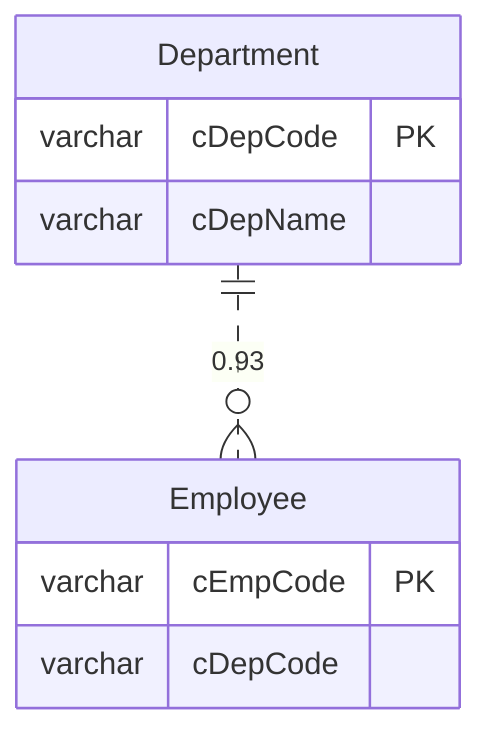

# Schema Analyzer 🔍

> 通用数据库结构分析器 - 自动推断表关系 + AI 增强字段解释

[](https://opensource.org/licenses/MIT)
[](https://golang.org/)
[](https://dashscope.aliyuncs.com/)

一个专为**遗留系统**（如用友 U8）设计的数据库结构分析工具，能够：
- 🔗 自动推断隐式外键关系（没有 FK 约束也能找到）
- 🤖 AI 解释字段含义（标准字段 + 自定义字段）
- 📊 生成数据字典和 ER 图
- 🎯 证据驱动，每个推断都有置信度和证据链

## ✨ 核心特性

### 1. 智能关系推断

```
Employee.cDepCode → Department.cDepCode (置信度: 93%)
证据:
  ✓ 列名相似度 (1.00): cDepCode ↔ cDepCode
  ✓ 数据类型匹配 (1.00): varchar(20) ↔ varchar(20)
  ✓ 值集合包含度 (0.98): 98% 的值存在于目标表
```

**算法**：命名相似度 × 0.3 + 类型匹配 × 0.2 + 值包含度 × 0.5

### 2. AI 增强字段解释

| 字段类型 | 识别方式 | 置信度 | 示例 |
|---------|---------|--------|------|
| **标准字段** | AI 直接识别 | 85-95% | `cDepCode` → "部门编码" |
| **自定义字段** | 关系推断 + AI | 60-80% | `cFree1` → "关联部门"（基于关联推断） |

### 3. AI 表关系和表意义分析

- 🤖 **表意义分析**：自动分析每个表的业务含义
- 🔗 **表关系分析**：基于表名和列结构推断表之间的关系
- 📊 **关系类型**：支持一对多、多对多、一对一关系

### 4. 多种输出格式

- **schema.json** - 完整的 Schema Graph（可编程）
- **dict.md** - 数据字典（人类可读）
- **er.mmd** - Mermaid ER 图（可视化）

## 🚀 快速开始

### 安装

```bash
# 克隆项目
git clone https://github.com/mumubuku/schema-analyzer.git
cd schema-analyzer

# 安装依赖
go mod download

# 构建
make build
```

### 基础使用（不用 AI）

```bash
# SQL Server (U8)
./schema-analyzer scan \
  --type sqlserver \
  --conn "server=localhost;user id=sa;password=your_password;database=your_database" \
  --output ./output

# MySQL
./schema-analyzer scan \
  --type mysql \
  --conn "user:password@tcp(localhost:3306)/database_name" \
  --schema database_name \
  --output ./output
```

### AI 增强模式

```bash
# 1. 获取阿里云 API Key
# 访问 https://dashscope.console.aliyuncs.com/

# 2. 设置环境变量
export DASHSCOPE_API_KEY="your_api_key_here"

# 3. 运行分析
./schema-analyzer scan \
  --type sqlserver \
  --conn "..." \
  --enable-ai \
  --ai-key "your_api_key_here" \
  --output ./output
```

## 📊 输出示例

### 数据字典（AI 增强版）

```markdown
### Department（部门档案）

| 列名 | 中文名 | 类型 | 业务含义 | 来源 | 置信度 |
|------|--------|------|----------|------|--------|
| cDepCode | 部门编码 | varchar | 用于标识部门的唯一编码 | 🤖标准 | 95% |
| cFree1 | 关联项目 | varchar | 基于与项目编码的关联推断 | 🔍推断 | 75% |

#### 关系
- **推断外键** `Employee.cDepCode` → `Department.cDepCode` (置信度: 0.93)
```

### ER 图



## 🎯 使用场景

- 📚 **遗留系统分析** - 理解没有文档的老系统
- 🔄 **数据库迁移** - 梳理表关系，规划迁移方案
- 👨‍💻 **新人上手** - 快速了解数据库结构
- 📊 **数据治理** - 发现数据质量问题
- 🎨 **BI 建模** - 识别维度表和事实表

## 💡 设计亮点

### 混合策略：算法 + AI

```
标准字段（cDepCode）
  → AI 直接识别 → "部门编码"（95%）

自定义字段（cFree1）
  → 算法推断关系 → 与 Department.cDepCode 关联（85%）
  → AI 基于关联推断 → "关联部门"（75%）
```

### 证据驱动

每个推断都有：
- ✅ 置信度分数（0-1）
- ✅ 详细证据（命名/类型/值包含）
- ✅ 可解释性强

### 隐私保护

AI 只接收：
- ✅ 表名、字段名
- ✅ 数据类型
- ✅ 统计摘要（null 率、唯一值率）

**不发送**：
- ❌ 实际数据值
- ❌ 敏感信息

## 📚 文档

- [Web 版使用指南](WEB_README.md) - 🌐 Web 界面使用
- [快速开始](QUICKSTART.md) - 5 分钟上手
- [AI 功能指南](README_AI.md) - AI 增强使用
- [快速参考](QUICK_REFERENCE.md) - 命令速查
- [详细使用](docs/USAGE.md) - 完整使用说明
- [AI 集成](docs/AI_INTEGRATION.md) - AI 集成详解
- [架构设计](docs/ARCHITECTURE.md) - 技术架构
- [扩展开发](docs/EXTENDING.md) - 如何扩展

## 🏗️ 架构

```
CLI → Renderer → Analyzer → Graph → Adapter → Database
                    ↓
                 AI Layer
```

- **Adapter 层**：数据库适配（插件化）
- **Graph 层**：Schema Graph 核心数据结构
- **Analyzer 层**：关系推断、枚举检测
- **AI 层**：字段解释（可选）
- **Renderer 层**：多格式输出

## 💰 成本

### 阿里云通义千问（AI 可选）

| 数据库规模 | 字段数 | 成本（qwen-plus） |
|-----------|--------|------------------|
| 小型（50表） | ~250 | ~¥0.5 |
| 中型（100表） | ~500 | ~¥1 |
| 大型（500表） | ~2500 | ~¥5 |

**免费额度**：新用户 100万 tokens

## 🔧 技术栈

- **语言**: Go 1.17+
- **数据库**: SQL Server, MySQL
- **AI**: 阿里云通义千问
- **CLI**: Cobra
- **算法**: Levenshtein 距离

## 🤝 贡献

欢迎提交 Issue 和 Pull Request！

## 📄 License

MIT License

## 🙏 致谢

- 阿里云通义千问
- Go 社区
- 所有贡献者

---

**⭐ 如果这个项目对你有帮助，请给个 Star！**