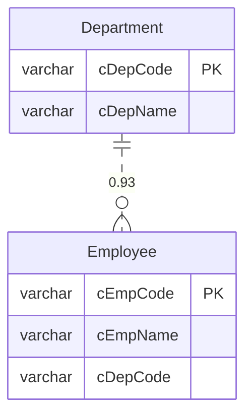

# 使用指南

## 快速开始

### 1. 安装

```bash
# 克隆项目
git clone <repo-url>
cd schema-analyzer

# 安装依赖
go mod download

# 构建
make build
```

### 2. 连接数据库

#### SQL Server (U8)

```bash
./schema-analyzer scan \
  --type sqlserver \
  --conn "server=192.168.1.100;user id=sa;password=Pass123;database=UFDATA_001_2023" \
  --output ./output
```

#### MySQL

```bash
./schema-analyzer scan \
  --type mysql \
  --conn "user:pass@tcp(192.168.1.100:3306)/business_db" \
  --schema business_db \
  --output ./output
```

### 3. 查看结果

分析完成后，在输出目录会生成三个文件：

1. **schema.json** - 完整的图数据（可用于程序集成）
2. **dict.md** - 数据字典（可直接阅读）
3. **er.mmd** - ER 图（用 Mermaid 查看）

## 输出示例

### schema.json 结构

```json
{
  "nodes": {
    "Department": {
      "id": "Department",
      "type": "table",
      "name": "Department",
      "properties": {
        "schema": "dbo"
      }
    },
    "Department.cDepCode": {
      "id": "Department.cDepCode",
      "type": "column",
      "name": "cDepCode",
      "properties": {
        "table": "Department",
        "data_type": "varchar",
        "length": 20,
        "nullable": false,
        "is_primary_key": true,
        "null_ratio": 0,
        "distinct_rate": 1.0
      }
    }
  },
  "edges": {
    "Employee.cDepCode->Department.cDepCode": {
      "id": "Employee.cDepCode->Department.cDepCode",
      "type": "inferred_fk",
      "from": "Employee.cDepCode",
      "to": "Department.cDepCode",
      "confidence": 0.93,
      "evidence": [
        {
          "type": "naming_similarity",
          "score": 1.0,
          "description": "列名相似度",
          "details": "cDepCode ↔ cDepCode (1.00)"
        },
        {
          "type": "type_match",
          "score": 1.0,
          "description": "数据类型匹配",
          "details": "varchar(20) ↔ varchar(20)"
        },
        {
          "type": "value_containment",
          "score": 0.98,
          "description": "值集合包含度",
          "details": "98.0% 的值存在于目标表"
        }
      ]
    }
  }
}
```

### dict.md 示例

```markdown
# 数据库结构文档

## 表结构

### Department

| 列名 | 类型 | 长度 | 可空 | 主键 | Null率 | 唯一值率 |
|------|------|------|------|------|--------|----------|
| cDepCode | varchar | 20 | 否 | ✓ | 0.0% | 100.0% |
| cDepName | varchar | 60 | 否 |  | 0.0% | 98.5% |

#### 关系

- **推断外键** `Employee.cDepCode` → `Department.cDepCode` (置信度: 0.93)
  - 证据:
    - 列名相似度 (1.00): cDepCode ↔ cDepCode (1.00)
    - 数据类型匹配 (1.00): varchar(20) ↔ varchar(20)
    - 值集合包含度 (0.98): 98.0% 的值存在于目标表
```

### er.mmd 示例



可以在 [Mermaid Live Editor](https://mermaid.live/) 中查看。

## 高级用法

### 调整采样大小

```bash
./schema-analyzer scan \
  --type sqlserver \
  --conn "..." \
  --sample 5000  # 增加采样提高准确度
```

### 只分析特定表

修改代码在 `IntrospectSchema` 中添加过滤：

```go
WHERE TABLE_NAME LIKE 'User%'  -- 只分析 User 开头的表
```

### 导出为其他格式

可以基于 `schema.json` 自己写转换脚本：

```python
import json

with open('output/schema.json') as f:
    graph = json.load(f)

# 转换为你需要的格式
# 例如：Neo4j、GraphQL Schema、SQL DDL 等
```

## 常见问题

### Q: 推断的关系不准确？

A: 可以调整置信度阈值，在 `main.go` 中修改：

```go
if edge != nil && edge.Confidence > 0.7 {  // 提高到 0.7
    edges = append(edges, edge)
}
```

### Q: 采样太慢？

A: 减少采样大小或只分析关键表：

```bash
--sample 500  # 减少采样
```

### Q: 如何处理大型数据库？

A: 
1. 分批分析（按 schema 或表前缀）
2. 使用并发（后续版本支持）
3. 缓存中间结果

### Q: 支持其他数据库吗？

A: 目前支持 SQL Server 和 MySQL。要添加新数据库：

1. 在 `internal/adapter/` 创建新适配器
2. 实现 `DBAdapter` 接口
3. 在 `main.go` 中注册

## 性能建议

- **小型数据库** (< 100 表)：默认配置即可
- **中型数据库** (100-500 表)：`--sample 500`
- **大型数据库** (> 500 表)：分批分析，`--sample 200`

## 集成到 CI/CD

```yaml
# .github/workflows/schema-check.yml
name: Schema Check

on:
  push:
    branches: [main]

jobs:
  analyze:
    runs-on: ubuntu-latest
    steps:
      - uses: actions/checkout@v2
      
      - name: Run Schema Analyzer
        run: |
          ./schema-analyzer scan \
            --type mysql \
            --conn "${{ secrets.DB_CONN }}" \
            --schema mydb \
            --output ./schema-report
      
      - name: Upload Report
        uses: actions/upload-artifact@v2
        with:
          name: schema-report
          path: ./schema-report/
```

## 下一步

- 查看 [架构设计](ARCHITECTURE.md)
- 查看 [扩展指南](EXTENDING.md)
- 提交 Issue 或 PR
